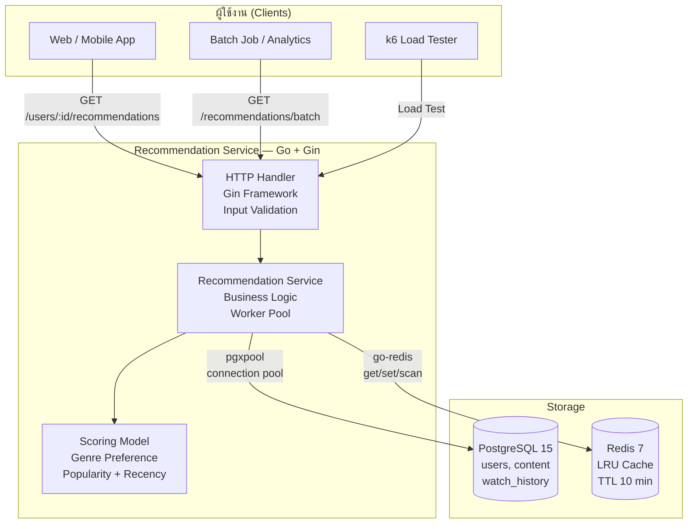
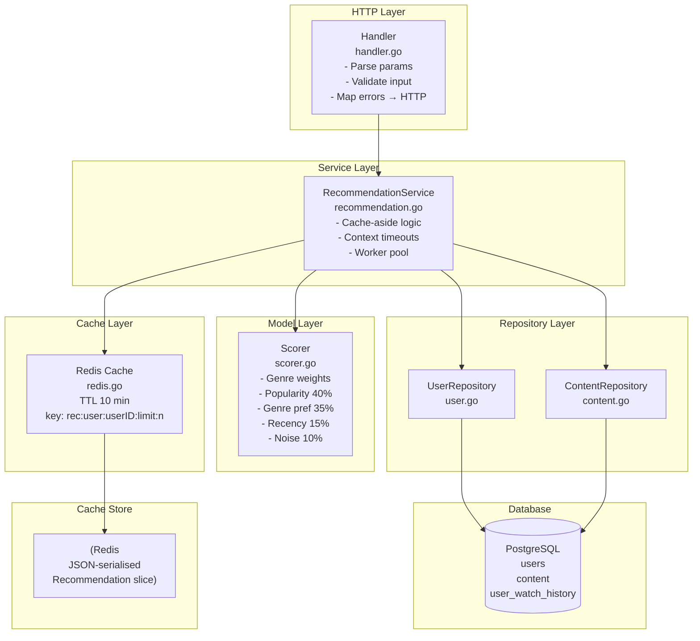
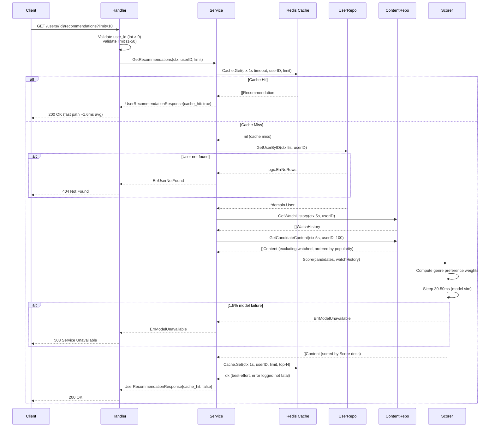
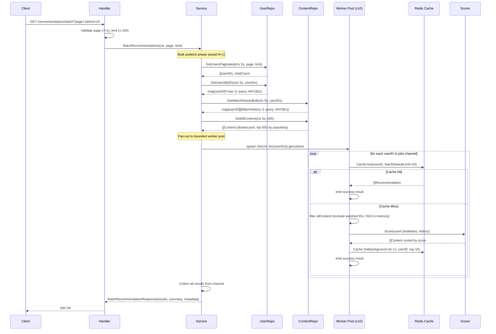
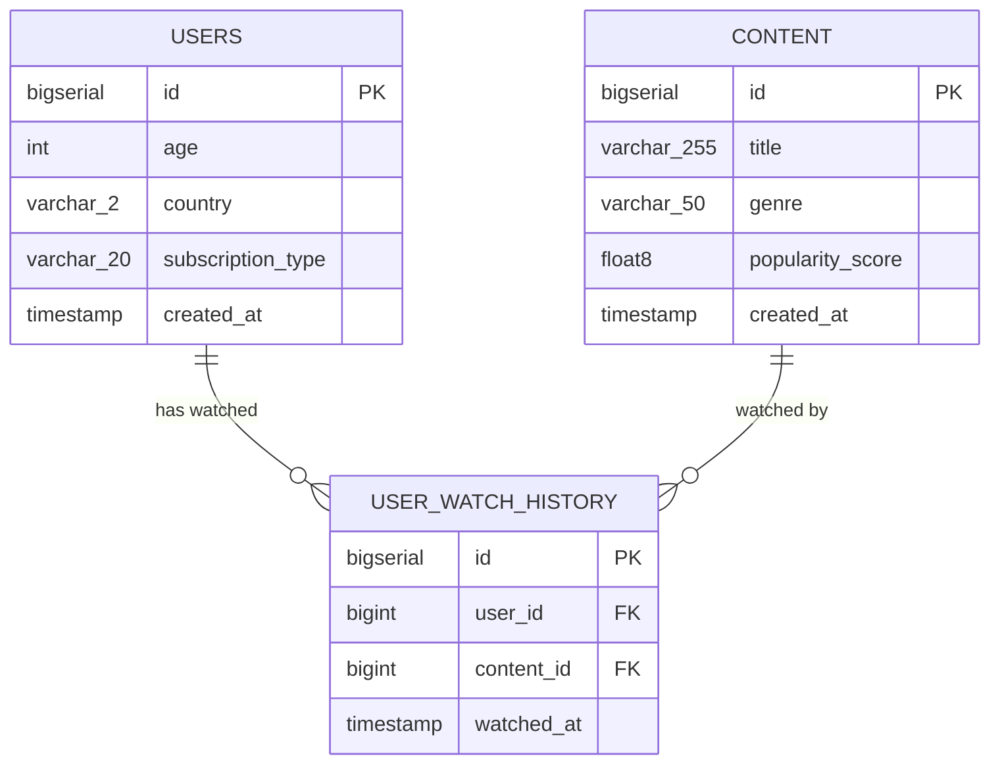
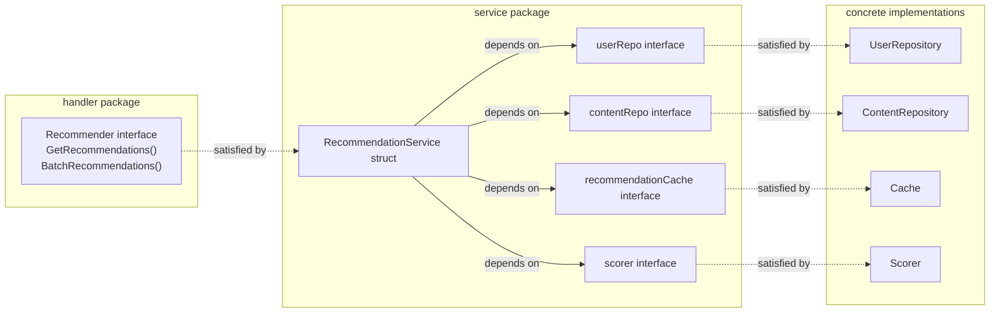
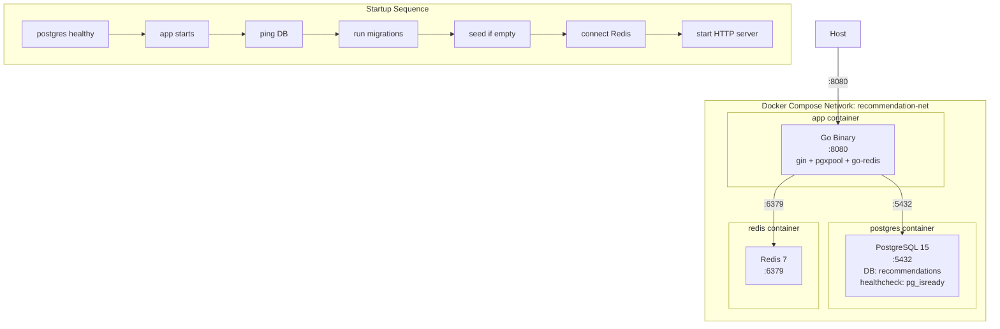

# Recommendation Service — Architecture & System Documentation

> เอกสารอธิบายโครงสร้าง, Flow การทำงาน, Tech Stack และเหตุผลในการเลือกใช้เทคโนโลยีทั้งหมด
> สำหรับนำเสนอและทำความเข้าใจระบบ Recommendation Service

---

## สารบัญ

### ส่วนที่ 1: ทำความเข้าใจระบบ
1. [ภาพรวมของระบบ (System Overview)](#1-ภาพรวมของระบบ)
2. [Tech Stack & เหตุผลในการเลือก](#2-tech-stack--เหตุผลในการเลือก)
3. [โครงสร้างโปรเจกต์ (Project Structure)](#3-โครงสร้างโปรเจกต์)
4. [System Architecture Diagram](#4-system-architecture-diagram)
5. [Single User Recommendation Flow](#5-single-user-recommendation-flow)
6. [Batch Recommendation Flow](#6-batch-recommendation-flow)
7. [Scoring Algorithm](#7-scoring-algorithm)
8. [Cache Strategy](#8-cache-strategy)
9. [Database Schema (ER Diagram)](#9-database-schema)
10. [API Endpoints Overview](#10-api-endpoints-overview)
11. [Dependency Injection Design](#11-dependency-injection-design)
12. [Deployment Architecture](#12-deployment-architecture)
13. [Load Test Scenarios](#13-load-test-scenarios)


---

## 1. ภาพรวมของระบบ

**Recommendation Service** คือ REST API แบบ Microservice ที่สร้างด้วย Go ทำหน้าที่:
- แนะนำ Content (movies/shows) ให้กับผู้ใช้แต่ละรายตาม Watch History และ Genre Preference
- รองรับ Batch Processing สำหรับประมวลผลหลาย User พร้อมกัน
- ใช้ Redis Cache เพื่อลด Latency และลด Load ที่ Database



---

## 2. Tech Stack & เหตุผลในการเลือก

### Backend

| เทคโนโลยี | เวอร์ชัน | ทำไมถึงเลือก |
|-----------|---------|-------------|
| **Go** | 1.26 | Goroutine-native concurrency, low GC overhead, fast compilation, ideal for high-throughput services |
| **Gin** | v1.9.1 | HTTP framework ที่ lightweight, เร็ว, middleware chain ชัดเจน |
| **pgx/v5** | v5.5.4 | PostgreSQL driver ที่เร็วที่สุดใน Go ecosystem, รองรับ `pgxpool` connection pooling |
| **go-redis/v9** | v9.4.0 | Redis client ที่ support context-aware operations ครบ (SCAN iterator, pipeline) |
| **golang-migrate** | v4.18.1 | Schema migration ที่ idempotent, safe to run on every startup |

### Infrastructure

| เทคโนโลยี | ทำไมถึงเลือก |
|-----------|-------------|
| **PostgreSQL 15** | ACID, foreign keys, composite indexes สำหรับ watch history queries |
| **Redis 7** | In-memory cache, TTL ในตัว, SCAN command สำหรับ pattern-based key lookup |
| **Docker Compose** | Local dev environment ที่ reproducible, health check aware |
| **k6** | Load testing ที่เขียน script ด้วย JavaScript, built-in metrics |

---

## 3. โครงสร้างโปรเจกต์ (Project Structure)

```
recommendation-service/
├── cmd/
│   └── server/
│       └── main.go               # Entry point: wire all dependencies, start HTTP server
├── internal/
│   ├── domain/
│   │   └── types.go              # Domain types: User, Content, WatchHistory, Recommendation, Response structs
│   ├── handler/
│   │   └── handler.go            # HTTP handlers, input validation, error mapping → HTTP status
│   ├── service/
│   │   └── recommendation.go     # Business logic: cache-aside pattern, worker pool orchestration
│   ├── model/
│   │   └── scorer.go             # Scoring algorithm: popularity + genre preference + recency
│   ├── repository/
│   │   ├── user.go               # DB queries: GetUserByID, GetUsersByIDs, GetUsersPaginated
│   │   └── content.go            # DB queries: GetWatchHistory, GetWatchHistoryBulk, GetCandidateContent, GetAllContent
│   ├── cache/
│   │   └── redis.go              # Redis wrapper: Get, Set, InvalidateUser (SCAN-based)
│   └── seeder/
│       └── seeder.go             # Deterministic seed: 300 users, 50 content, ~3000 watch records
├── migrations/
│   ├── 001_init.up.sql           # Create tables + 7 indexes
│   └── 001_init.down.sql         # Drop tables
├── tests/
│   └── k6/
│       ├── load_test.js          # Single-user endpoint: 100 VUs, ramp 30s+1m+30s
│       ├── batch_test.js         # Batch endpoint: 20 VUs, page sizes 20/50/100
│       └── cache_test.js         # Cache hit rate: 10 VUs, 5 users fixed set, 2 min
├── docs/
│   └── SOLUTION_PLAN.md          # Implementation plan document
├── docker-compose.yml            # 3 services: app, postgres, redis
├── Dockerfile                    # Multi-stage build (builder + runtime)
├── Makefile                      # Common commands: build, run, test, seed
└── go.mod                        # Module: github.com/CN164/recommendation-service
```

---

## 4. System Architecture Diagram



---

## 5. Single User Recommendation Flow



---

## 6. Batch Recommendation Flow



---

## 7. Scoring Algorithm

```
Score = popularity_component + genre_component + recency_component + noise
```

### สูตรคำนวณ

| Component | สูตร | น้ำหนัก | คำอธิบาย |
|-----------|------|--------|----------|
| **Popularity** | `PopularityScore × 0.40` | 40% | ค่า popularity ดั้งเดิมจาก DB (power-law distribution 0–1) |
| **Genre Preference** | `genrePref × 0.35` | 35% | สัดส่วน genre ที่ user เคยดู / total watches |
| **Recency** | `(1 / (1 + daysSince/365)) × 0.15` | 15% | Content ใหม่กว่า = score สูงกว่า (decay over 1 year) |
| **Noise** | `rand × 0.01 × 0.10` | ~0% | Jitter เล็กน้อยเพื่อ break ties (±0.0005 range) |

### Genre Preference Calculation

```go
// ตัวอย่าง: user ดูมาแล้ว 10 เรื่อง (6 action, 3 drama, 1 comedy)
genrePrefs["action"]  = 6/10 = 0.60
genrePrefs["drama"]   = 3/10 = 0.30
genrePrefs["comedy"]  = 1/10 = 0.10
// content genre ที่ไม่เคยดู default = 0.10 (genreBoost fallback)
```

### Model Simulation

```go
// Goroutine-safe random (mutex-protected)
s.mu.Lock()
sleepMs     := 30 + rng.Intn(21)       // 30-50ms latency simulation
failureRoll := rng.Float64()            // for failure simulation
noises       := make([]float64, N)      // noise values per candidate
s.mu.Unlock()

time.Sleep(duration)                    // outside lock — no contention during sleep

if failureRoll < 0.015 {               // 1.5% failure rate → ErrModelUnavailable
    return nil, ErrModelUnavailable
}
```

---

## 8. Cache Strategy

### Cache Key Design

```
rec:user:{userID}:limit:{limit}
```

ตัวอย่าง:
- `rec:user:42:limit:10` — user 42, limit 10
- `rec:user:42:limit:20` — คนละ key กัน เพราะ result ต่างกัน

### Cache-Aside Pattern

```
1. Try GET from Redis (timeout: 1s)
2. Hit  → return immediately (no DB, no scoring)
3. Miss → query DB + score → SET Redis (timeout: 1s, TTL: 10min)
```

### Cache Invalidation

```go
// SCAN-based (non-blocking) — replaces old KEYS command
pattern := "rec:user:{userID}:limit:*"
iter := client.Scan(ctx, 0, pattern, 0).Iterator()
// collects all matching keys → DEL in one call
```

**ทำไมไม่ใช้ KEYS?**
- `KEYS` เป็น O(N) blocking operation — หยุด Redis event loop ระหว่างที่ scan ทุก key
- `SCAN` เป็น cursor-based iteration — ไม่ block, safe ใน production keyspace ขนาดใหญ่

### TTL Policy

| Scenario | TTL |
|----------|-----|
| Cached recommendations | 10 minutes |
| Redis Get timeout | 1 second |
| Redis Set timeout | 1 second |

---

## 9. Database Schema



### Indexes

| Index | Table | Columns | Purpose |
|-------|-------|---------|---------|
| `idx_users_country` | users | country | Filter by country |
| `idx_users_subscription` | users | subscription_type | Filter by subscription |
| `idx_content_genre` | content | genre | Filter by genre |
| `idx_content_popularity` | content | popularity_score DESC | ORDER BY popularity (most-used query) |
| `idx_watch_history_user` | user_watch_history | user_id | Single-user lookups |
| `idx_watch_history_content` | user_watch_history | content_id | Content lookups |
| `idx_watch_history_composite` | user_watch_history | (user_id, watched_at DESC) | User history sorted by time |

### Seed Data (fixed seed = 42 for reproducibility)

| Table | Count | Distribution |
|-------|-------|-------------|
| content | 50 | 5 genres (action/drama/comedy/thriller/documentary), power-law popularity |
| users | 300 | 7 countries, subscription: 50% free / 30% basic / 20% premium |
| user_watch_history | ~3000 | Popularity-biased selection, ON CONFLICT DO NOTHING |

---

## 10. API Endpoints Overview

| Method | Endpoint | Description | Auth |
|--------|----------|-------------|------|
| GET | `/health` | Health check | None |
| GET | `/users/:user_id/recommendations` | Single user recommendations | None |
| GET | `/recommendations/batch` | Batch recommendations for a page of users | None |

### GET /users/:user_id/recommendations

**Parameters:**
| Param | Type | Default | Validation | Location |
|-------|------|---------|------------|----------|
| `user_id` | int64 | required | > 0 | path |
| `limit` | int32 | 10 | 1–50 | query |

**Response 200:**
```json
{
  "user_id": 42,
  "recommendations": [
    {
      "content_id": 7,
      "title": "Content 7",
      "genre": "action",
      "popularity_score": 0.85,
      "score": 0.623
    }
  ],
  "metadata": {
    "cache_hit": true,
    "generated_at": "2026-03-14T10:00:00Z",
    "total_count": 10
  }
}
```

**Error Responses:**

| Status | Error Code | Condition |
|--------|-----------|-----------|
| 400 | `invalid_parameter` | user_id ≤ 0, limit out of range |
| 404 | `user_not_found` | user_id ไม่มีใน DB |
| 503 | `model_unavailable` | Scorer ล้มเหลว (1.5% chance) |
| 500 | `internal_error` | DB error อื่นๆ |

### GET /recommendations/batch

**Parameters:**
| Param | Type | Default | Validation | Location |
|-------|------|---------|------------|----------|
| `page` | int32 | 1 | ≥ 1 | query |
| `limit` | int32 | 20 | 1–100 | query |

**Response 200:**
```json
{
  "page": 1,
  "limit": 20,
  "total_users": 300,
  "results": [
    {
      "user_id": 1,
      "recommendations": [...],
      "status": "success"
    },
    {
      "user_id": 2,
      "status": "failed",
      "error": "model_inference_timeout",
      "message": "Recommendation generation exceeded timeout limit"
    }
  ],
  "summary": {
    "success_count": 19,
    "failed_count": 1,
    "processing_time_ms": 85
  },
  "metadata": {
    "generated_at": "2026-03-14T10:00:00Z"
  }
}
```

---

## 11. Dependency Injection Design

ระบบใช้ **Consumer-side Interface** pattern ตาม Go idioms



### การ Wire ที่ main.go

```go
// 1. สร้าง concrete implementations
userRepo    := repository.NewUserRepository(dbPool)
contentRepo := repository.NewContentRepository(dbPool)
scorer      := model.NewScorer()
cacheLayer  := cache.NewCache(redisURL)

// 2. Inject into service (service รับ interface, ไม่รู้จัก concrete types)
recService := service.NewRecommendationService(userRepo, contentRepo, cacheLayer, scorer)

// 3. Inject into handler (handler รับ Recommender interface)
h := handler.NewHandler(recService)
```

**ข้อดีของ design นี้:**
- Interface อยู่ที่ฝั่ง consumer (handler, service) ไม่ใช่ provider → ป้องกัน import cycle
- Test ได้ง่าย: mock แทน concrete implementation ได้โดยตรง
- Go structural typing: concrete types satisfy interfaces อัตโนมัติ ไม่ต้อง `implements`

---

## 12. Deployment Architecture



### Connection Pool Configuration

```go
dbConfig.MaxConns         = 20           // max concurrent connections
dbConfig.MinConns         = 5            // warm connections always ready
dbConfig.MaxConnLifetime  = time.Hour    // recycle long-lived connections
dbConfig.MaxConnIdleTime  = 30 * time.Minute
dbConfig.HealthCheckPeriod = time.Minute // proactive health check
```

### Graceful Shutdown

```go
// SIGINT / SIGTERM → srv.Shutdown(10s timeout) → drain active requests
sigChan := make(chan os.Signal, 1)
signal.Notify(sigChan, syscall.SIGINT, syscall.SIGTERM)
<-sigChan
srv.Shutdown(ctx) // gives 10s for in-flight requests to complete
```

---

## 13. Load Test Scenarios

| Test | File | VUs | Duration | Target Endpoint |
|------|------|-----|----------|----------------|
| **load_test** | load_test.js | 0→50→100→0 | 30s+1m+30s | GET /users/:id/recommendations |
| **batch_test** | batch_test.js | 0→10→20→0 | 30s+1m+30s | GET /recommendations/batch |
| **cache_test** | cache_test.js | 10 fixed | 2 min | GET /users/:id/recommendations (5 users only) |

### load_test.js — Logic

```javascript
const userId = Math.floor(Math.random() * 300) + 1; // random from all 300 users
// Thresholds: p(95)<500ms, p(99)<1000ms, error rate < 3%
// Checks: status 200, has recommendations, has metadata, cache_hit field set
sleep(0.1); // 100ms between requests → ~100 RPS at 100 VUs
```

### batch_test.js — Logic

```javascript
const page  = Math.floor(Math.random() * 3) + 1;            // page 1-3
const limit = [20, 50, 100][Math.floor(Math.random() * 3)]; // variable batch sizes
// Threshold: p(95)<3000ms (batch takes longer due to 10-worker × 30-50ms model sim)
sleep(1); // 1s between requests
```

### cache_test.js — Logic

```javascript
const userId = Math.floor(Math.random() * 5) + 1; // only 5 users → high cache hit
// Custom metrics: cache_hit_rate (Rate), cache_hit_latency_ms (Trend), cache_miss_latency_ms (Trend)
// Threshold: cache_hit_rate > 70%
// First pass warms cache, second pass measures hits
```

